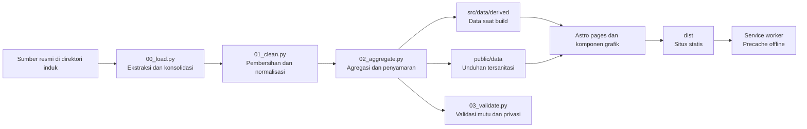

# Lima Tahun FMIPA

Web data story untuk **Laporan Dekan FMIPA UGM 2021–2026**. Proyek ini mengubah data kinerja, akademik, riset, kerja sama, lulusan, kesehatan, dan profil mahasiswa menjadi cerita panjang yang dapat dibaca, dipresentasikan, ditelusuri metodologinya, serta dibuka kembali tanpa jaringan.

Snapshot utama saat ini adalah **31 Agustus 2026**. Data P2M ditarik pada 19 Agustus 2026 dan data LENTERA pada 20 Agustus 2026. Semua tanggal berasal dari satu konstanta pipeline, bukan teks yang ditulis ulang di tiap komponen.

## Cerita yang dibangun

Laporan ini tidak dimulai sebagai dashboard. Pembaca dibawa dari satu temuan utama menuju konteks, bukti, ketegangan, lalu agenda tindak lanjut.

| Tahap narasi | Peran dalam cerita | Implementasi saat ini |
| --- | --- | --- |
| **1. Hook** | Membuka dengan angka yang langsung memberi skala perubahan | Cold open menampilkan lompatan sitasi dalam lima tahun |
| **2. Orientasi** | Menjawab “FMIPA berada di posisi mana sekarang?” | Potret institusi, 42 indikator TCK 2026, dan model transformasi nilai |
| **3. Bukti utama** | Membawa pembaca menelusuri perubahan, bukan hanya angka akhir | Lima pilar: Reputasi Akademik, Kontribusi terhadap Bangsa, Employability & Lulusan, Tata Kelola & Kesejahteraan, serta Mahasiswa & Akses Pendidikan |
| **4. Ketegangan** | Menunjukkan capaian yang belum merata, konflik angka, dan data yang belum tersedia | Insight, status target, anomali sumber, serta kartu *data gap* ditampilkan di dalam alur |
| **5. Resolusi** | Mengubah laporan masa lalu menjadi pijakan kerja berikutnya | Bagian estafet merangkum agenda akselerasi dan fondasi data untuk kepemimpinan selanjutnya |

Cerita utama terdiri dari **35 scene bernomor dan satu cold open**. Naskah ringkas untuk deck tidak disalin manual dari halaman panjang: kalimat yang memuat angka bergerak dihitung dari dataset yang sama agar presentasi dan laporan tidak saling menyimpang.

## Pengalaman pembaca

| Rute | Pengalaman | Kegunaan |
| --- | --- | --- |
| `/` | Cerita panjang tiga bagian, lima pilar, grafik, insight, dan catatan metodologi | Membaca laporan lengkap secara mandiri |
| `/presentasi` | Deck layar penuh berisi 36 slide, catatan presenter, navigasi keyboard/klik, layar penuh, dan tata cetak | Presentasi rapat atau forum pimpinan |
| `/data` | Katalog 40 dataset, sumber, definisi, konflik angka, anomali, kualitas data, dan agenda penguatan | Audit metodologi dan unduh data agregat |

Pada deck, gunakan `←`/`→`, `Page Up`/`Page Down`, atau `Space` untuk berpindah; `Home`/`End` untuk menuju awal/akhir; `P` untuk catatan presenter; dan `F` untuk layar penuh. Klik sisi kiri atau kanan slide juga memindahkan halaman.

## Keadaan proyek terkini

- Lima pilar sudah terhubung ke 35 scene bernomor, satu cold open, dan deck 36 slide.
- Pilar terbaru, **Mahasiswa & Akses Pendidikan**, memotret 4.945 mahasiswa pada enam angkatan 2021–2026: program studi, wilayah asal, gender, jalur masuk, latar wali, sekolah asal, status akhir, dan IPK.
- Halaman Data & Metodologi mencatat 40 dataset publik atau referensi GeoJSON yang dapat ditelusuri ke scene pemakainya.
- Dua belas komponen grafik yang dapat digunakan ulang mencakup garis/area, batang, stacked bar, bullet, slope, dot matrix, trend rows, bubble, risk profile, grid SDG, choropleth, dan point map.
- Setiap grafik penting dapat dipahami tanpa interaksi, menyediakan label aksesibel, dan memiliki tabel data alternatif atau tautan unduhan.
- Tema terang/gelap, progres membaca, `prefers-reduced-motion`, indikator fokus, *forced colors*, layout responsif, dan gaya cetak sudah tersedia.
- Build produksi menghasilkan situs statis dan service worker dengan cache ber-versi untuk seluruh output build.
- Deployment GitHub Pages dikonfigurasi melalui workflow pada setiap push ke `main`.

## Dari sumber data menjadi cerita



Data mentah sengaja berada **satu tingkat di atas repositori aplikasi**. `pipeline/work/` hanya menjadi ruang kerja lokal dan diabaikan Git. Hanya agregat untuk build dan unduhan yang telah disanitasi yang masuk ke repositori.

## Mulai cepat

Untuk mengembangkan tampilan dengan data turunan yang sudah ada di repositori, Anda hanya memerlukan Node.js **22.12+**:

```bash
npm install
npm run dev
```

Buka URL lokal yang ditampilkan Astro. Tiga rute utama langsung tersedia tanpa menjalankan ulang pipeline Python.

Build dan preview produksi:

```bash
npm run build
npm run preview
```

### Menyiapkan pipeline data

Untuk membentuk ulang dataset, siapkan Python **3.11+**, sumber resmi di direktori induk, dan virtual environment proyek:

```bash
python -m venv .venv

# Windows
.venv/Scripts/python.exe -m pip install -r pipeline/requirements.txt

# macOS/Linux
.venv/bin/python -m pip install -r pipeline/requirements.txt
```

`npm run data` dan `npm run validate:data` memilih interpreter `.venv` secara otomatis, jadi virtual environment tidak perlu diaktifkan manual.

## Perintah proyek

| Perintah | Fungsi |
| --- | --- |
| `npm run dev` | Menjalankan Astro development server |
| `npm start` | Alias untuk development server |
| `npm run data` | Menjalankan `00_load.py`, `01_clean.py`, dan `02_aggregate.py` secara berurutan |
| `npm run validate:data` | Memeriksa integritas, angka jangkar, mutu, privasi, dan keluaran wajib |
| `npm run check` | Menjalankan type-check Astro/TypeScript |
| `npm run build` | Type-check, membangun situs statis, lalu membuat service worker berisi precache aktual |
| `npm run preview` | Menjalankan preview dari output `dist/` |
| `npm run verify` | Menjalankan pipeline, validasi data, build, pemeriksaan tautan/fragmen, dan audit precache |

Verifikasi penuh sebelum rilis:

```bash
npm run verify
```

## Memperbarui data

1. Timpa berkas sumber di direktori induk dengan versi terbaru. Pertahankan nama berkas dan struktur sheet yang dibaca pipeline.
2. Perbarui `SNAPSHOT`, `SNAPSHOT_LABEL`, dan tanggal penarikan per sumber di `pipeline/utils.py`.
3. Jalankan pipeline dan validasi.
4. Tinjau perubahan pada `src/data/derived/`, `public/data/`, dan `pipeline/work/validation_report.json`.
5. Jalankan build lengkap dan baca ulang scene yang angkanya berubah.

```bash
npm run data
npm run validate:data
npm run build
node pipeline/check-build.mjs
```

Jika semua tahap perlu dijalankan sekaligus, gunakan `npm run verify`.

### Sumber yang dibaca pipeline

| Sumber | Lokasi relatif terhadap direktori induk | Dipakai untuk |
| --- | --- | --- |
| Ekspor P2M, 14 jenis dataset dalam 23 berkas CSV | `data ugm/p2m/` | Sitasi, publikasi, riset, PkM, SDM, jurnal, dan media |
| `TCK 2026.xlsx` | `target_capaian_kinerja/tck_2026/` | 42 indikator kinerja dan rincian departemen |
| Workbook LENTERA | `data ugm/kerjasama/` | Dokumen kerja sama 2021–2026 |
| Tabel akademik dan tracer study | `data ugm/akademik/` | Penerimaan, mahasiswa aktif, lulusan, prestasi, beasiswa, akreditasi, exchange, dan tracer study |
| Enam daftar mahasiswa per angkatan | `data ugm/akademik/daftar mahasiswa/` | Profil mahasiswa 2021–2026, akses, latar, status akhir, dan IPK |
| Rekap Posbindu | `data ugm/health promotion university posbindu/` | Agregat Health Promoting University |

Excel dan CSV dibaca langsung. Tidak ada tahap konversi manual sebelum pipeline dijalankan.

## Prinsip data dan privasi

- **Sumber tetap terpisah.** TCK 2026 diperlakukan sebagai snapshot berjalan, sedangkan seri historis tetap mempertahankan periode dan definisinya sendiri.
- **Status TCK diturunkan secara eksplisit.** Rasio capaian terhadap target kuartal menghasilkan empat status: ≥100% tercapai, ≥85% mendekati, ≥50% tertinggal, dan di bawah 50% meleset. Indikator berarah turun memakai rasio terbalik.
- **Satuan tidak direka.** Indikator 1c dinormalisasi ke miliar rupiah. Indikator persentase #5b dan #8b1–8b3 dinilai pada TW2 karena kolom TW3 berisi cacah tanpa penyebut; cacah tetap disimpan pada kolom `_cacah`.
- **Anomali menjadi bagian cerita.** Capaian yang tidak kumulatif, konflik antarsumber, nilai gedung hijau, lokasi kosong, dan gap K3L/PPKS ditampilkan, bukan diperbaiki diam-diam.
- **Koordinat tidak ditebak.** Peta memakai agregasi centroid provinsi; 619 catatan PkM tanpa lokasi tetap dilaporkan sebagai tidak terpetakan.
- **Data individu tidak dipublikasikan.** Nama, NIM/NIP/NIU, alamat, kontak, identitas wali, tanggal lahir, dan nilai pemeriksaan kesehatan dibuang sebelum keluaran ditulis.
- **Sel kecil disamarkan.** Tabulasi mahasiswa berisi satu atau dua orang menjadi `null` dengan penanda `disamarkan`, bukan nol. Validasi menggagalkan proses jika cacah di bawah tiga lolos.
- **Normalisasi dapat diaudit.** Jalur masuk, pekerjaan wali, bidang kerja tracer study, risiko Posbindu, provinsi, dan metadata TCK disimpan di `pipeline/mappings/`.
- **Peta memiliki atribusi.** Batas provinsi berasal dari [Peta Nusa / Laravel Nusa](https://github.com/AlfianAliM/Indonesia-GeoJSON) berlisensi MIT. Batas negara berasal dari [Natural Earth 1:110m](https://github.com/nvkelso/natural-earth-vector) yang berada di domain publik.

Rincian transformasi dan keputusan per tahap tersedia di [pipeline/README.md](pipeline/README.md). Versi yang dibaca pembaca umum tersedia pada halaman `/data`.

## Struktur repositori

```text
.
├── .github/workflows/deploy.yml   # build dan deploy GitHub Pages
├── pipeline/
│   ├── 00_load.py                 # ekstraksi dan konsolidasi
│   ├── 01_clean.py                # normalisasi dan pembuangan data privat
│   ├── 02_aggregate.py            # dataset turunan dan penyamaran sel kecil
│   ├── 03_validate.py             # validasi data, mutu, dan privasi
│   ├── mappings/                  # aturan kurasi yang dapat diaudit
│   └── check-build.mjs            # smoke test hasil build
├── public/
│   ├── data/                      # dataset publik tersanitasi
│   ├── brand/                     # identitas visual
│   └── fonts/                     # Gama Sans dan Gama Serif
├── src/
│   ├── components/                # scene, layout cerita, dan elemen narasi
│   ├── components/charts/         # komponen visualisasi reusable
│   ├── data/derived/              # data JSON yang diimpor saat build
│   ├── i18n/id.ts                 # pertanyaan scene dan naskah ringkas deck
│   ├── pages/                     # /, /data, /presentasi, dan 404
│   └── styles/                    # token, global, dan mode presentasi
└── astro.config.mjs               # konfigurasi static build dan base path
```

## Deployment dan offline

Push ke `main` menjalankan `.github/workflows/deploy.yml` dan menerbitkan `dist/` ke GitHub Pages. Di GitHub Actions, base path project site dihitung dari owner dan nama repositori. Repositori khusus `<owner>.github.io` tetap memakai root.

Untuk host lain, atur URL publik dan subpath saat build:

```bash
# Bash/zsh
PUBLIC_SITE_URL=https://contoh.github.io PUBLIC_BASE_PATH=/laporan-dekan-2026 npm run build
```

```powershell
# PowerShell
$env:PUBLIC_SITE_URL = "https://contoh.github.io"
$env:PUBLIC_BASE_PATH = "/laporan-dekan-2026"
npm run build
```

Untuk domain sendiri di root, isi `PUBLIC_SITE_URL` dan biarkan `PUBLIC_BASE_PATH` kosong. Host statis lain cukup menerima isi `dist/`.

Service worker dibuat ulang dari isi `dist/` setelah setiap build. Untuk rapat tanpa jaringan, buka `/presentasi` sekali saat masih online dan tunggu halaman selesai dimuat agar cache versi terbaru terpasang.

> Repositori sumber boleh privat, tetapi situs GitHub Pages dan seluruh isi `public/` tetap dapat diakses publik. Jangan menaruh data individu, credential, atau materi internal di `public/` maupun `src/data/derived/`.

## Batas interpretasi

Laporan ini adalah snapshot pertanggungjawaban, bukan sistem transaksi waktu nyata. Seri 2025 yang bergantung pada pemutakhiran Scopus masih dapat bertambah; TCK 2026 bersifat provisional; dan beberapa metrik memiliki periode, penyebut, atau basis populasi berbeda. Batas tersebut sengaja diletakkan dekat dengan grafik serta dirangkum kembali di `/data` agar pembaca tidak memperoleh kepastian yang tidak didukung sumber.
