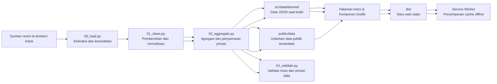

# Lima Tahun FMIPA

Web data story untuk **Laporan Dekan FMIPA UGM 2021–2026**. Proyek ini mengubah data kinerja, akademik, riset, kerja sama, lulusan, kesehatan, dan profil mahasiswa menjadi cerita panjang yang dapat dibaca, dipresentasikan, ditelusuri metodologinya, serta dibuka kembali tanpa jaringan.
Pembaruan 7 September 2026: kiriman data baru menambahkan ekstrak kepegawaian
SIMASTER, berkas akreditasi terbaru, profil lulusan pascasarjana 2025/2026,
penerimaan kerja sama beserta Dana Pengembangan Institusi, dan daftar sekolah
penanda tangan MoU Juli 2026. Komposisi jabatan dosen kini berasal dari satu
sumber tunggal — penggabungan dua sumber yang sebelumnya terpaksa dilakukan
sudah dibongkar. Empat adegan baru ditambahkan (3.5′, 5.1′, 5.1″, dan 6.6′),
sehingga cerita utama menjadi 41 adegan dan deck menjadi 40 slide. Rincian ada di
[catatan visualisasi](docs/visualisasi-20260905.md) dan [pipeline](pipeline/README.md).

Pembaruan 12 September 2026: visualisasi sitasi tahunan pada scene 2.1 diganti dengan distribusi jumlah sitasi per publikasi dari ekspor `Publications_in_Faculty_of_Mathematics_and_Natural_Sciences_UGM_1996_-_2027.csv`. Berkas diekspor pada **12 September 2026** dengan data diperbarui **6 September 2026**. Seri sitasi tahunan P2M telah berhenti dicatat dan hanya disimpan sebagai arsip. Ringkasan sitasi pada pembuka, model nilai, dan presentasi mengikuti sumber baru dengan definisi sitasi kumulatif atas publikasi terbit 2021–2025.

## Cerita yang dibangun
Aplikasi web berbasis narasi data (*data storytelling*) untuk menyajikan **Laporan Dekan FMIPA UGM Periode 2021–2026**. Proyek ini merangkum data kinerja institusi, akademik, riset, kerja sama, profil lulusan, kesehatan sivitas akademika, hingga demografi mahasiswa menjadi sajian interaktif yang nyaman dibaca, siap dipresentasikan, transparan secara metodologi, dan dapat diakses secara *offline*.

Laporan ini tidak dimulai sebagai dashboard. Pembaca dibawa dari satu temuan utama menuju konteks, bukti, ketegangan, lalu agenda tindak lanjut.
Tanggal rujukan dicatat per sumber: TCK **31 Agustus 2026**, P2M **19 Agustus 2026**, LENTERA **20 Agustus 2026**, serta kepegawaian SIMASTER dan tabel akademik pendamping **3 September 2026**. SciVal memakai dua snapshot: **30 Agustus 2026** untuk pemetaan departemen, topik, kolaborasi, akses terbuka, dan laporan FWCI per bidang; **6 September 2026** untuk profil sitasi dari ekspor 12 September. Metadata tersimpan pada `snapshot.json` dan `citation_profile.json`, sehingga cakupan sumber dapat ditelusuri di setiap bagian.

| Tahap narasi | Peran dalam cerita | Implementasi saat ini |
## Konsep & Struktur Narasi

Laporan ini dirancang bukan sekadar sebagai *dashboard* kumpulan angka mentah, melainkan alur cerita bertahap yang memandu pembaca dari temuan kunci, pembuktian data, dinamika capaian, hingga agenda strategis ke depan.

| Tahap Narasi | Peran dalam Narasi | Wujud Implementasi |
| --- | --- | --- |
| **1. Hook** | Membuka dengan angka yang menunjukkan skala kegiatan dan jangkauan riset | Cold open merangkum publikasi terbit 2021–2025, sitasi kumulatif publikasi tersebut pada tanggal sumber, dan kegiatan pengabdian |
| **2. Orientasi** | Menjawab “FMIPA berada di posisi mana sekarang?” | Potret institusi, 42 indikator TCK 2026, dan model transformasi nilai |
| **3. Bukti utama** | Membawa pembaca menelusuri perubahan, bukan hanya angka akhir | Lima pilar: Reputasi Akademik, Kontribusi terhadap Bangsa, Employability & Lulusan, Tata Kelola & Kesejahteraan, serta Mahasiswa & Akses Pendidikan |
| **4. Ketegangan** | Menunjukkan capaian yang belum merata, konflik angka, dan data yang belum tersedia | Insight, status target, anomali sumber, serta kartu *data gap* ditampilkan di dalam alur |
| **5. Resolusi** | Mengubah laporan masa lalu menjadi pijakan kerja berikutnya | Bagian estafet merangkum agenda akselerasi dan fondasi data untuk kepemimpinan selanjutnya |

Scene riset memiliki pertanyaan berbeda agar narasinya tidak berulang: **2.1** menunjukkan sebaran jangkauan rujukan melalui kelompok sitasi per publikasi; **2.2** memetakan volume publikasi menurut departemen; **2.2p** membandingkan FWCI antarbidang; **2.3** memperlihatkan topik; **2.4** memetakan mitra kolaborasi; dan **2.4p** menjelaskan jalur akses terbuka. Ringkasan pembuka memakai angka tingkat periode, sedangkan scene 2.1 menguraikan distribusi seluruh portofolio.

Cerita utama terdiri dari **35 scene bernomor dan satu cold open**. Naskah ringkas untuk deck tidak disalin manual dari halaman panjang: kalimat yang memuat angka bergerak dihitung dari dataset yang sama agar presentasi dan laporan tidak saling menyimpang.
Narasi utama tersusun atas **41 adegan (*scene*) tematik dan satu adegan pembuka (*cold open*)**. Seluruh naskah ringkas pada slide presentasi (*deck*) dihitung dan digenerasi langsung dari sumber data yang sama dengan laporan utama, sehingga tidak ada perbedaan angka di antara keduanya.

## Pengalaman pembaca
## Halaman & Antarmuka Pengguna

| Rute | Pengalaman | Kegunaan |
| Rute | Format Tampilan | Kegunaan Utama |
| --- | --- | --- |
| `/` | Cerita panjang tiga bagian, lima pilar, grafik, insight, dan catatan metodologi | Membaca laporan lengkap secara mandiri |
| `/presentasi` | Deck layar penuh berisi 36 slide, catatan presenter, navigasi keyboard/klik, layar penuh, dan tata cetak | Presentasi rapat atau forum pimpinan |
| `/data` | Katalog 40 dataset, sumber, definisi, konflik angka, anomali, kualitas data, dan agenda penguatan | Audit metodologi dan unduh data agregat |
| `/` | Laporan interaktif panjang (*longform*): 3 babak, 5 pilar, visualisasi grafik, ulasan analitis, dan catatan metodologi | Membaca laporan lengkap secara mendalam dan mandiri |
| `/presentasi` | Slide presentasi (*deck*) 40 slide layar penuh, dilengkapi catatan presenter (*speaker notes*), pintasan keyboard, dan format siap cetak | Presentasi rapat kerja, sidang senat, atau forum pimpinan |
| `/data` | Katalog 59 dataset, definisi variabel, rekam jejak anomali/konflik data, audit kualitas, dan tautan unduh data agregat | Audit metodologi, verifikasi sumber, dan keterbukaan data |

Pada deck, gunakan `←`/`→`, `Page Up`/`Page Down`, atau `Space` untuk berpindah; `Home`/`End` untuk menuju awal/akhir; `P` untuk catatan presenter; dan `F` untuk layar penuh. Klik sisi kiri atau kanan slide juga memindahkan halaman.
### Pintasan Navigasi Slide Presentasi (`/presentasi`)
- **Pindah slide:** Tombol panah `←` / `→`, `Page Up` / `Page Down`, atau `Spasi` (bisa juga dengan mengklik sisi kiri/kanan layar).
- **Awal / Akhir:** Tombol `Home` / `End`.
- **Catatan Presenter:** Tekan `P` untuk membuka atau menutup catatan pembicara.
- **Layar Penuh:** Tekan `F` untuk masuk ke mode layar penuh (*fullscreen*).

## Keadaan proyek terkini
## Ringkasan Fitur & Kondisi Terkini

- Lima pilar sudah terhubung ke 35 scene bernomor, satu cold open, dan deck 36 slide.
- Lima pilar sudah terhubung ke 37 scene bernomor, satu cold open, dan deck 36 slide.
- Pilar terbaru, **Mahasiswa & Akses Pendidikan**, memotret 4.945 mahasiswa pada enam angkatan 2021–2026: program studi, wilayah asal, gender, jalur masuk, latar wali, sekolah asal, status akhir, dan IPK.
- Halaman Data & Metodologi mencatat 40 dataset publik atau referensi GeoJSON yang dapat ditelusuri ke scene pemakainya.
- Dua belas komponen grafik yang dapat digunakan ulang mencakup garis/area, batang, stacked bar, bullet, slope, dot matrix, trend rows, bubble, risk profile, grid SDG, choropleth, dan point map.
- Setiap grafik penting dapat dipahami tanpa interaksi, menyediakan label aksesibel, dan memiliki tabel data alternatif atau tautan unduhan.
- Tema terang/gelap, progres membaca, `prefers-reduced-motion`, indikator fokus, *forced colors*, layout responsif, dan gaya cetak sudah tersedia.
- Build produksi menghasilkan situs statis dan service worker dengan cache ber-versi untuk seluruh output build.
- Deployment GitHub Pages dikonfigurasi melalui workflow pada setiap push ke `main`.
- **Cakupan Narasi:** 5 pilar strategis telah terhubung ke 41 adegan narasi, 1 adegan pembuka, dan 40 slide presentasi.
- **Pilar Mahasiswa & Akses Pendidikan:** Menganalisis data 4.945 mahasiswa dari 6 angkatan (2021–2026), meliputi sebaran prodi, daerah asal, gender, jalur masuk, latar belakang orang tua/wali, sekolah asal, status kelulusan, dan distribusi IPK.
- **Katalog Data Terbuka:** Halaman Metodologi mengelola 59 dataset publik dan referensi batas wilayah GeoJSON yang terhubung langsung ke visualisasi terkait.
- **Pustaka Visualisasi:** Menyediakan 12 tipe komponen visualisasi data modular (*reusable*), mulai dari grafik garis/area, diagram batang, *stacked bar*, *bullet chart*, *slope chart*, *dot matrix*, deret tren (*trend rows*), *bubble chart*, matriks profil risiko, kisi capaian SDG, peta tematik *choropleth*, hingga *point map*.
- **Aksesibilitas & Keterbacaan:** Semua grafik dirancang agar tetap informatif tanpa harus diinteraksi/hover, ramah bagi pembaca layar (*screen reader*), serta dilengkapi opsi tabel data alternatif atau berkas unduhan.
- **Desain Adaptif:** Mendukung tema gelap/terang, indikator progres membaca, penyesuaian gerak (*reduced motion*), indikator fokus keyboard, mode kontras tinggi (*forced colors*), tata letak responsif di berbagai ukuran layar, serta gaya khusus cetak (*print stylesheet*).
- **Akses Tanpa Internet (Offline-Ready):** Proses *build* menghasilkan berkas statis murni yang dilengkapi *Service Worker* dan sistem *cache versioning* otomatis untuk seluruh aset keluaran.
- **Otomatisasi Deployment:** Konfigurasi GitHub Actions akan otomatis melakukan kompilasi dan pembaruan rilis ke GitHub Pages setiap kali ada pembaruan pada cabang `main`.

## Dari sumber data menjadi cerita
## Alur Pengolahan Data (*Pipeline*)



Data mentah sengaja berada **satu tingkat di atas repositori aplikasi**. `pipeline/work/` hanya menjadi ruang kerja lokal dan diabaikan Git. Hanya agregat untuk build dan unduhan yang telah disanitasi yang masuk ke repositori.
Sumber data mentah sengaja diletakkan di **luar repositori (satu tingkat di direktori induk)** guna menjaga kerahasiaan data privat. Folder `pipeline/work/` hanya berfungsi sebagai area kerja lokal dan diabaikan oleh Git. Repositori ini hanya menyimpan data hasil agregasi untuk kebutuhan kompilasi web serta berkas unduhan publik yang sudah disanitasi.

## Mulai cepat
## Panduan Menjalankan Proyek

Untuk mengembangkan tampilan dengan data turunan yang sudah ada di repositori, Anda hanya memerlukan Node.js **22.12+**:
### 1. Menjalankan Tampilan Web (Frontend)

Jika Anda hanya ingin menjalankan web atau mengembangkan antarmuka menggunakan data agregat yang sudah ada di repositori, Anda cukup menyiapkan Node.js versi **22.12 ke atas**:

```bash
# Pasang dependensi
npm install

# Jalankan server pengembangan lokal
npm run dev
```

Buka URL lokal yang ditampilkan Astro. Tiga rute utama langsung tersedia tanpa menjalankan ulang pipeline Python.
Buka tautan lokal yang ditampilkan di terminal (biasanya `http://localhost:4321`). Tiga rute utama dapat langsung diakses tanpa perlu menjalankan skrip Python.

Build dan preview produksi:
Untuk membangun dan menguji hasil produksi secara lokal:

```bash
npm run build
npm run preview
```

### Menyiapkan pipeline data
### 2. Menyiapkan dan Menjalankan Pipeline Data (Opsional)

Untuk membentuk ulang dataset, siapkan Python **3.11+**, sumber resmi di direktori induk, dan virtual environment proyek:
Jika Anda perlu memproses ulang data dari berkas sumber aslinya, siapkan Python versi **3.11 ke atas**, pastikan folder data mentah tersedia di direktori induk, lalu pasang dependensi *virtual environment*:

```bash
# Buat virtual environment
python -m venv .venv

# Windows
# Pasang dependensi di Windows
.venv/Scripts/python.exe -m pip install -r pipeline/requirements.txt

# macOS/Linux
# Pasang dependensi di macOS / Linux
.venv/bin/python -m pip install -r pipeline/requirements.txt
```

`npm run data` dan `npm run validate:data` memilih interpreter `.venv` secara otomatis, jadi virtual environment tidak perlu diaktifkan manual.
> Skrip `npm run data` dan `npm run validate:data` akan otomatis menggunakan interpreter Python dari folder `.venv`, sehingga Anda tidak perlu mengaktifkan *virtual environment* secara manual.

## Perintah proyek
## Daftar Perintah Proyek

| Perintah | Fungsi |
| Perintah | Deskripsi Fungsi |
| --- | --- |
| `npm run dev` | Menjalankan Astro development server |
| `npm start` | Alias untuk development server |
| `npm run data` | Menjalankan `00_load.py`, `01_clean.py`, dan `02_aggregate.py` secara berurutan |
| `npm run validate:data` | Memeriksa integritas, angka jangkar, mutu, privasi, dan keluaran wajib |
| `npm run check` | Menjalankan type-check Astro/TypeScript |
| `npm run build` | Type-check, membangun situs statis, lalu membuat service worker berisi precache aktual |
| `npm run preview` | Menjalankan preview dari output `dist/` |
| `npm run verify` | Menjalankan pipeline, validasi data, build, pemeriksaan tautan/fragmen, dan audit precache |
| `npm run dev` | Menjalankan server pengembangan lokal Astro |
| `npm start` | Perintah alternatif (*alias*) untuk menjalankan server pengembangan |
| `npm run data` | Menjalankan tahapan *pipeline* pengolahan data (`00_load.py`, `01_clean.py`, dan `02_aggregate.py`) secara berurutan |
| `npm run validate:data` | Memeriksa integritas data, angka acuan (*anchor numbers*), mutu data, privasi, dan kelengkapan berkas keluaran |
| `npm run check` | Menjalankan pemeriksaan tipe data (*type-check*) pada kode Astro dan TypeScript |
| `npm run build` | Menjalankan *type-check*, membangun situs statis ke folder `dist/`, dan memperbarui *service worker* untuk *cache* |
| `npm run preview` | Menjalankan server lokal untuk meninjau hasil *build* pada folder `dist/` |
| `npm run verify` | Menjalankan pengujian menyeluruh: *pipeline* data, validasi data, *build*, pengecekan tautan/fragmen, dan audit *precache* |

Verifikasi penuh sebelum rilis:
Untuk menjalankan verifikasi menyeluruh sebelum melakukan rilis:

```bash
npm run verify
```

## Memperbarui data
## Alur Pembaruan Data

1. Timpa berkas sumber di direktori induk dengan versi terbaru. Pertahankan nama berkas dan struktur sheet yang dibaca pipeline.
2. Perbarui `SNAPSHOT`, `SNAPSHOT_LABEL`, dan tanggal penarikan per sumber di `pipeline/utils.py`.
3. Jalankan pipeline dan validasi.
4. Tinjau perubahan pada `src/data/derived/`, `public/data/`, dan `pipeline/work/validation_report.json`.
5. Jalankan build lengkap dan baca ulang scene yang angkanya berubah.
1. **Perbarui berkas sumber:** Salin atau timpa berkas mentah di direktori induk dengan data terbaru (pastikan struktur *sheet* dan nama berkas tetap sama).
2. **Sesuaikan konfigurasi tanggal:** Perbarui konstanta `SNAPSHOT`, `SNAPSHOT_LABEL`, dan tanggal penarikan data per sumber di berkas `pipeline/utils.py`.
3. **Proses dan validasi data:** Jalankan skrip *pipeline* dan pastikan pengujian validasi lolos tanpa galat.
4. **Periksa hasil perubahan:** Tinjau pembaruan berkas di `src/data/derived/`, `public/data/`, dan ringkasan di `pipeline/work/validation_report.json`.
5. **Kompilasi dan evaluasi narasi:** Bangun ulang situs web (*build*) dan baca kembali adegan-adegan yang mengalami perubahan angka.

```bash
npm run data
npm run validate:data
npm run build
node pipeline/check-build.mjs
```

Jika semua tahap perlu dijalankan sekaligus, gunakan `npm run verify`.
*Jika ingin menjalankan seluruh tahapan di atas sekaligus secara otomatis, gunakan perintah `npm run verify`.*

### Sumber yang dibaca pipeline
### Berkas Sumber yang Dibaca Pipeline

| Sumber | Lokasi relatif terhadap direktori induk | Dipakai untuk |
| Sumber Data | Lokasi Relatif (di Direktori Induk) | Digunakan Untuk |
| --- | --- | --- |
| Ekspor P2M, 14 jenis dataset dalam 23 berkas CSV | `data ugm/p2m/` | Sitasi, publikasi, riset, PkM, SDM, jurnal, dan media |
| `TCK 2026.xlsx` | `target_capaian_kinerja/tck_2026/` | 42 indikator kinerja dan rincian departemen |
| Workbook LENTERA | `data ugm/kerjasama/` | Dokumen kerja sama 2021–2026 |
| Tabel akademik dan tracer study | `data ugm/akademik/` | Penerimaan, mahasiswa aktif, lulusan, prestasi, beasiswa, akreditasi, exchange, dan tracer study |
| Enam daftar mahasiswa per angkatan | `data ugm/akademik/daftar mahasiswa/` | Profil mahasiswa 2021–2026, akses, latar, status akhir, dan IPK |
| Rekap Posbindu | `data ugm/health promotion university posbindu/` | Agregat Health Promoting University |
| Ekspor P2M (13 jenis dataset dalam 21 berkas CSV) | `data ugm/p2m/` | Sitasi, riset, pengabdian (PkM), SDM dosen & tendik, jurnal, dan eksposur media |
| Ekspor SciVal Langsung (per 30 Agustus 2026) | `data ugm/p2m/from_scival/` | 3.069 publikasi periode 2020–2026 untuk departemen, akses terbuka, topik, kolaborasi, dan SDG; serta laporan FWCI 27 bidang ASJC. Cakupannya tetap terpisah dari profil sitasi September |
| Ekspor profil sitasi SciVal (ekspor 12 September, data 6 September 2026) | `data ugm/p2m/from_scival/Publications_in_Faculty_of_Mathematics_and_Natural_Sciences_UGM_1996_-_2027.csv` | 5.139 publikasi unik bertahun 1996–2027, dengan 43.632 sitasi kumulatif; sumber profil dan distribusi sitasi serta ringkasan publikasi terbit 2021–2025 |
| Salinan P2M `publication_scival_exported_*.csv` | `data ugm/p2m/` | Penetapan departemen hasil kurasi fakultas untuk 1.682 publikasi, dipertahankan karena ekspor SciVal tidak memuat kolom departemen |
| `TCK 2026.xlsx` | `target_capaian_kinerja/tck_2026/` | 42 indikator capaian kinerja dan rincian capaian departemen |
| Buku Kerja LENTERA | `data ugm/kerjasama/` | Rekapitulasi dokumen kerja sama dan kemitraan 2021–2026 |
| Tabel Akademik & Tracer Study | `data ugm/akademik/` | Penerimaan mahasiswa, mahasiswa aktif, lulusan, prestasi, beasiswa, akreditasi, pertukaran pelajar, dan hasil *tracer study* |
| Rekapitulasi Mahasiswa (6 Angkatan) | `data ugm/akademik/daftar mahasiswa/` | Profil demografi mahasiswa 2021–2026: jalur masuk, asal daerah & sekolah, latar belakang wali, status kelulusan, dan IPK |
| Rekapitulasi Posbindu HPU | `data ugm/health promotion university posbindu/` | Agregasi data kesehatan sivitas akademika (*Health Promoting University*) |
| Ekstrak Kepegawaian SIMASTER (4 berkas, 3 September 2026) | `data ugm/Laporan Dekan 2026/SDM/` | Komposisi jabatan fungsional 207 dosen, 120 tenaga kependidikan, TMT pengangkatan Guru Besar, rasio dosen tanpa jabatan akademik, dan status sertifikasi pendidik |
| `AKREDITASI PRODI MIPA.xlsx` | `data ugm/Laporan Dekan 2026/` | Status akreditasi nasional 18 prodi dan akreditasi internasional 15 prodi |
| `PENERIMA BEASISWA.xlsx` | `data ugm/Laporan Dekan 2026/` | Rekapitulasi 703 penerima beasiswa pada 79 skema |
| `Profil Lulusan Magister.xls` dan `Profil Lulusan Doktor.xls` | `data ugm/Laporan Dekan 2026/` | Lulusan, IPK, lama studi, dan TOEFL pascasarjana tahun akademik 2025/2026 |
| `Penerimaan dan DPI Kerjasama Fakultas MIPA 2021-2026.xlsx` | `data ugm/Laporan Dekan 2026/` | Nilai kontrak kerja sama dan Dana Pengembangan Institusi 2022–2026 |
| `Daftar Peserta MoU FMIPA UGM_No PKS FMIPA UGM.xlsx` | `data ugm/kerjasama/` | Sekolah penanda tangan nota kesepahaman 29–31 Juli 2026 (hanya nama sekolah yang dibaca) |

Excel dan CSV dibaca langsung. Tidak ada tahap konversi manual sebelum pipeline dijalankan.
> Berkas Excel dan CSV dibaca langsung oleh skrip pemrosesan tanpa memerlukan konversi manual sebelumnya.

## Prinsip data dan privasi
## Prinsip Tata Kelola Data & Privasi

- **Sumber tetap terpisah.** TCK 2026 diperlakukan sebagai snapshot berjalan, sedangkan seri historis tetap mempertahankan periode dan definisinya sendiri.
- **Status TCK diturunkan secara eksplisit.** Rasio capaian terhadap target kuartal menghasilkan empat status: ≥100% tercapai, ≥85% mendekati, ≥50% tertinggal, dan di bawah 50% meleset. Indikator berarah turun memakai rasio terbalik.
- **Satuan tidak direka.** Indikator 1c dinormalisasi ke miliar rupiah. Indikator persentase #5b dan #8b1–8b3 dinilai pada TW2 karena kolom TW3 berisi cacah tanpa penyebut; cacah tetap disimpan pada kolom `_cacah`.
- **Anomali menjadi bagian cerita.** Capaian yang tidak kumulatif, konflik antarsumber, nilai gedung hijau, lokasi kosong, dan gap K3L/PPKS ditampilkan, bukan diperbaiki diam-diam.
- **Koordinat tidak ditebak.** Peta memakai agregasi centroid provinsi; 619 catatan PkM tanpa lokasi tetap dilaporkan sebagai tidak terpetakan.
- **Data individu tidak dipublikasikan.** Nama, NIM/NIP/NIU, alamat, kontak, identitas wali, tanggal lahir, dan nilai pemeriksaan kesehatan dibuang sebelum keluaran ditulis.
- **Sel kecil disamarkan.** Tabulasi mahasiswa berisi satu atau dua orang menjadi `null` dengan penanda `disamarkan`, bukan nol. Validasi menggagalkan proses jika cacah di bawah tiga lolos.
- **Normalisasi dapat diaudit.** Jalur masuk, pekerjaan wali, bidang kerja tracer study, risiko Posbindu, provinsi, dan metadata TCK disimpan di `pipeline/mappings/`.
- **Peta memiliki atribusi.** Batas provinsi berasal dari [Peta Nusa / Laravel Nusa](https://github.com/AlfianAliM/Indonesia-GeoJSON) berlisensi MIT. Batas negara berasal dari [Natural Earth 1:110m](https://github.com/nvkelso/natural-earth-vector) yang berada di domain publik.
- **Pemisahan Sumber yang Tegas:** Data TCK 2026 diperlakukan sebagai potret capaian berjalan (*rolling snapshot*), sedangkan deret historis (2021–2025) tetap mempertahankan rentang waktu dan definisinya masing-masing tanpa dipaksakan seragam.
- **Penentuan Status Kinerja yang Eksplisit:** Rasio capaian terhadap target triwulan diklasifikasikan ke dalam 4 kategori capaian: **Tercapai** (≥100%), **Mendekati** (≥85%), **Tertinggal** (≥50%), dan **Meleset** (<50%). Untuk indikator dengan target penurunan (seperti waktu tunggu kerja lulusan), rasio dihitung secara terbalik.
- **Integritas Satuan & Data:** Nilai keuangan dinormalisasi ke satuan miliar rupiah tanpa perkiraan bebas. Indikator persentase yang tidak mencantumkan angka penyebut pada kolom triwulan tertentu (misalnya pada beberapa indikator TW3) dievaluasi menggunakan basis TW2, sedangkan angka pembilangnya disimpan tersendiri sebagai data cacah (`_cacah`).
- **Transparansi terhadap Anomali:** Realisasi non-kumulatif, perbedaan data antarsumber, status pemeringkatan gedung hijau, data kegiatan tanpa lokasi, maupun celah data (*data gaps* seperti K3L dan PPKS) diulas secara terbuka dalam narasi, bukan disembunyikan atau diubah sepihak.
- **Akurasi Pemetaan Spasial:** Visualisasi peta menggunakan titik pusat (*centroid*) resmi provinsi. Sebanyak 619 kegiatan PkM yang tidak memiliki keterangan lokasi tetap dicatat secara transparan sebagai "tidak terpetakan".
- **Perlindungan Data Pribadi (Anonimisasi Penuh):** Informasi identitas sensitif seperti Nama, NIP/NIKA/NIDN/NUPTK, NIM/NIU, alamat, nomor kontak, data wali, tanggal lahir, rekam medis individual Posbindu, serta nama dan jabatan peserta penandatanganan MoU sekolah langsung dihapus sebelum berkas keluaran disimpan.
- **Satu Sumber untuk Satu Fakta:** Sejak ekstrak SIMASTER 3 September 2026 tersedia, seluruh angka kepegawaian berasal dari satu berkas resmi. Penggabungan dua sumber yang sebelumnya dipakai (daftar nama pada rincian TCK ditumpangkan pada roster riset P2M) sudah dibongkar, dan selisih yang tersisa terhadap dokumen TCK dilaporkan terbuka, bukan diselaraskan diam-diam.
- **Penyamaran Sel Kecil (*Small-Cell Suppression*):** Untuk mencegah identifikasi individu, kelompok data mahasiswa berjumlah 1 atau 2 orang disamarkan nilainya menjadi `null` (berstatus *disamarkan*), bukan diganti angka nol. Skrip validasi akan otomatis menggagalkan proses jika ditemukan data beranggotakan kurang dari 3 orang yang lolos tanpa penyamaran.
- **Standardisasi yang Dapat Diaudit:** Seluruh kamus standardisasi (jalur masuk, pekerjaan wali, bidang kerja alumni, klasifikasi risiko Posbindu, kode provinsi, dan metadata TCK) terdokumentasi rapi di folder `pipeline/mappings/`.
- **Atribusi Data Wilayah:** Data batas wilayah provinsi menggunakan [Peta Nusa / Laravel Nusa](https://github.com/AlfianAliM/Indonesia-GeoJSON) berlisensi MIT. Batas wilayah internasional menggunakan data [Natural Earth 1:110m](https://github.com/nvkelso/natural-earth-vector) yang berada dalam domain publik.

Rincian transformasi dan keputusan per tahap tersedia di [pipeline/README.md](pipeline/README.md). Versi yang dibaca pembaca umum tersedia pada halaman `/data`.
Panduan teknis mengenai tahapan transformasi data dapat dipelajari lebih lanjut di [pipeline/README.md](pipeline/README.md). Penjelasan metodologi bagi pembaca umum tersedia langsung di halaman `/data`.

## Struktur repositori
## Struktur Repositori

```text
.
├── .github/workflows/deploy.yml   # build dan deploy GitHub Pages
├── .github/workflows/deploy.yml   # Alur kerja otomatisasi build & rilis ke GitHub Pages
├── pipeline/
│   ├── 00_load.py                 # ekstraksi dan konsolidasi
│   ├── 01_clean.py                # normalisasi dan pembuangan data privat
│   ├── 02_aggregate.py            # dataset turunan dan penyamaran sel kecil
│   ├── 03_validate.py             # validasi data, mutu, dan privasi
│   ├── mappings/                  # aturan kurasi yang dapat diaudit
│   └── check-build.mjs            # smoke test hasil build
│   ├── 00_load.py                 # Ekstraksi dan konsolidasi data mentah
│   ├── 01_clean.py                # Pembersihan data, standardisasi, dan penghapusan data privat
│   ├── 02_aggregate.py            # Pembuatan dataset turunan dan penyamaran sel data kecil
│   ├── 03_validate.py             # Validasi mutu data, angka acuan, dan kepatuhan privasi
│   ├── mappings/                  # Kamus pemetaan dan standardisasi kategori
│   └── check-build.mjs            # Pengujian fungsional dan integritas tautan hasil build
├── public/
│   ├── data/                      # dataset publik tersanitasi
│   ├── brand/                     # identitas visual
│   └── fonts/                     # Gama Sans dan Gama Serif
│   ├── data/                      # Kumpulan dataset publik yang telah disanitasi (siap unduh)
│   ├── brand/                     # Aset logo dan identitas visual FMIPA UGM
│   └── fonts/                     # Berkas jenis huruf Gama Sans dan Gama Serif
├── src/
│   ├── components/                # scene, layout cerita, dan elemen narasi
│   ├── components/charts/         # komponen visualisasi reusable
│   ├── data/derived/              # data JSON yang diimpor saat build
│   ├── i18n/id.ts                 # pertanyaan scene dan naskah ringkas deck
│   ├── pages/                     # /, /data, /presentasi, dan 404
│   └── styles/                    # token, global, dan mode presentasi
└── astro.config.mjs               # konfigurasi static build dan base path
│   ├── components/                # Komponen antarmuka, tata letak babak, dan elemen narasi
│   ├── components/charts/         # Koleksi komponen visualisasi grafik modular
│   ├── data/derived/              # Berkas data JSON agregat untuk proses build web
│   ├── i18n/id.ts                 # Teks narasi, pertanyaan adegan, dan naskah ringkas presentasi
│   ├── pages/                     # Halaman utama (/), katalog data (/data), presentasi (/presentasi), dan 404
│   └── styles/                    # Desain sistem, variabel desain (tokens), dan gaya presentasi
└── astro.config.mjs               # Konfigurasi Astro static-site generator dan path situs
```

## Deployment dan offline
## Penerbitan (*Deployment*) & Akses Offline

Push ke `main` menjalankan `.github/workflows/deploy.yml` dan menerbitkan `dist/` ke GitHub Pages. Di GitHub Actions, base path project site dihitung dari owner dan nama repositori. Repositori khusus `<owner>.github.io` tetap memakai root.
Setiap pengiriman (*push*) kode ke cabang `main` akan memicu workflow `.github/workflows/deploy.yml` untuk mengompilasi dan menerbitkan folder `dist/` ke GitHub Pages. Di lingkungan GitHub Actions, jalur dasar (*base path*) dihitung secara otomatis berdasarkan nama akun dan repositori.

Untuk host lain, atur URL publik dan subpath saat build:
### Konfigurasi Host Mandiri (*Custom Host / Domain*)

Jika ingin memasang aplikasi di server web atau subdirektori lain, tentukan URL publik dan *subpath* saat menjalankan *build*:

**Bash / Zsh (Linux / macOS):**
```bash
# Bash/zsh
PUBLIC_SITE_URL=https://contoh.github.io PUBLIC_BASE_PATH=/laporan-dekan-2026 npm run build
PUBLIC_SITE_URL=https://fmipa.ugm.ac.id PUBLIC_BASE_PATH=/laporan-dekan-2026 npm run build
```

**PowerShell (Windows):**
```powershell
# PowerShell
$env:PUBLIC_SITE_URL = "https://contoh.github.io"
$env:PUBLIC_SITE_URL = "https://fmipa.ugm.ac.id"
$env:PUBLIC_BASE_PATH = "/laporan-dekan-2026"
npm run build
```

Untuk domain sendiri di root, isi `PUBLIC_SITE_URL` dan biarkan `PUBLIC_BASE_PATH` kosong. Host statis lain cukup menerima isi `dist/`.
*Jika aplikasi dipasang pada root domain utama, isi `PUBLIC_SITE_URL` dan biarkan `PUBLIC_BASE_PATH` kosong.*

Service worker dibuat ulang dari isi `dist/` setelah setiap build. Untuk rapat tanpa jaringan, buka `/presentasi` sekali saat masih online dan tunggu halaman selesai dimuat agar cache versi terbaru terpasang.
### Penggunaan Saat Presentasi Tanpa Internet (*Offline*)

> Repositori sumber boleh privat, tetapi situs GitHub Pages dan seluruh isi `public/` tetap dapat diakses publik. Jangan menaruh data individu, credential, atau materi internal di `public/` maupun `src/data/derived/`.
*Service Worker* akan otomatis diperbarui dan disesuaikan dengan isi folder `dist/` setiap kali proses *build* selesai. Untuk keperluan presentasi rapat tanpa koneksi internet:
1. Buka halaman `/presentasi` satu kali saat perangkat masih terhubung ke internet.
2. Tunggu beberapa saat hingga halaman dan aset selesai dimuat agar seluruh materi tersimpan ke dalam *cache*.
3. Halaman presentasi siap digunakan kapan saja meskipun tanpa jaringan internet.

## Batas interpretasi
> [!WARNING]
> Meskipun repositori kode dapat disetel privat, hasil terbitan di GitHub Pages dan seluruh isi folder `public/` bersifat terbuka untuk umum. Pastikan **tidak ada data pribadi (PII), kredensial, maupun dokumen internal sensitif** yang tersimpan di dalam `public/` ataupun `src/data/derived/`.

## Batasan & Catatan Interpretasi Data

Laporan ini merupakan potret pertanggungjawaban berkala (*periodic snapshot*), bukan sistem basis data transaksi waktu nyata (*real-time database*). Dalam membaca data ini, harap perhatikan beberapa konteks berikut:
- Pada ekspor profil sitasi, `Year` adalah tahun publikasi dan `Citations` adalah sitasi kumulatif hingga **6 September 2026**. Agregat publikasi terbit **2021–2025** berisi **2.340 publikasi** dan **16.564 sitasi**; angka sitasi tersebut mencakup waktu setelah 2025 dan tidak merepresentasikan sitasi yang terjadi selama lima tahun itu.
- Distribusi scene 2.1 membagi **5.139 publikasi** ke dalam kelompok saling lepas: **0 sitasi: 1.084**, **1–9: 2.776**, **10–49: 1.138**, **50–99: 119**, dan **≥100: 22**. Sebanyak **4.055 publikasi (78,9%)** tercatat telah disitasi. Grafik menggambarkan jangkauan rujukan portofolio; usia publikasi berbeda sehingga distribusi ini tidak menjadi bukti tren mutu antarangkatan.
- Ekspor baru memuat **382 publikasi bertahun 2026** dan **4 rekaman bertahun 2027**. Rekaman 2027 dipertahankan dalam distribusi seluruh ekspor, tetapi tidak diperlakukan sebagai capaian masa depan atau dimasukkan ke ringkasan publikasi terbit 2021–2025.
- Profil baru tersedia pada `citation_profile.json`, sedangkan grafik memakai `citation_distribution.json` dan `citation_distribution.csv`. Berkas `citations_by_year.json` tetap tersedia sebagai arsip seri P2M yang pencatatannya terhenti; tidak ada narasi atau grafik yang menggunakannya sebagai sumber aktif.
- Indikator TCK menghitung capaian pada tahun anggaran. Nilainya tidak dibandingkan langsung dengan akumulasi sitasi pada kumpulan publikasi yang dipilih menurut tahun penerbitannya. Demikian pula, penyebut 5.139 publikasi dari sumber September tidak dicampur dengan 3.069 publikasi pada scene departemen, topik, kolaborasi, dan akses terbuka dari sumber Agustus.
- Data TCK 2026 masih berstatus sementara (*provisional*) mengikuti periode penarikan data berjalan.
- Beberapa metrik memiliki perbedaan cakupan tahun, dasar populasi, maupun metode penghitungan penyebut.

Seluruh batasan konteks ini disajikan berdampingan dengan visualisasi terkait serta dirangkum secara lengkap di halaman `/data` demi menjaga objektivitas dan keakuratan pemaknaan data.

