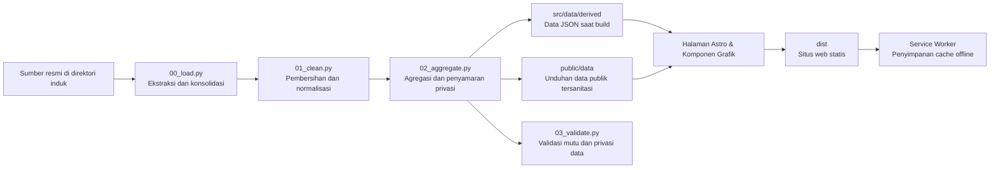

# Lima Tahun FMIPA

Aplikasi web berbasis narasi data (*data storytelling*) untuk menyajikan **Laporan Dekan FMIPA UGM Periode 2021–2026**. Proyek ini merangkum data kinerja institusi, akademik, riset, kerja sama, profil lulusan, kesehatan sivitas akademika, hingga demografi mahasiswa menjadi sajian interaktif yang nyaman dibaca, siap dipresentasikan, transparan secara metodologi, dan dapat diakses secara *offline*.

Basis data (*snapshot*) utama laporan ini tercatat per **31 Agustus 2026** (data P2M ditarik pada 19 Agustus 2026 dan data LENTERA pada 20 Agustus 2026). Seluruh tanggal dikelola terpusat melalui satu konstanta *pipeline*, sehingga penyajian angka dan konteks waktu selalu konsisten di setiap bagian.

## Konsep & Struktur Narasi

Laporan ini dirancang bukan sekadar sebagai *dashboard* kumpulan angka mentah, melainkan alur cerita bertahap yang memandu pembaca dari temuan kunci, pembuktian data, dinamika capaian, hingga agenda strategis ke depan.

| Tahap Narasi | Peran dalam Narasi | Wujud Implementasi |
| --- | --- | --- |
| **1. Hook** | Membuka laporan dengan angka kunci yang memperlihatkan skala perubahan | Adegan pembuka (*cold open*) yang menyorot lonjakan sitasi dalam 5 tahun terakhir |
| **2. Orientasi** | Menjawab pertanyaan: *"Di mana posisi FMIPA saat ini?"* | Gambaran umum institusi, capaian 42 indikator Target Capaian Kinerja (TCK) 2026, dan model transformasi nilai |
| **3. Bukti Utama** | Mengajak pembaca menelusuri proses perubahan, bukan sekadar angka akhir | Lima pilar tematik: Reputasi Akademik, Kontribusi terhadap Bangsa, Daya Serap Lulusan (*Employability*), Tata Kelola & Kesejahteraan, serta Mahasiswa & Akses Pendidikan |
| **4. Tantangan & Kesenjangan** | Memotret capaian yang belum merata, perbedaan data antarsumber, dan ruang yang perlu ditingkatkan | Sorotan kritis (*insights*), status capaian target, anomali data, serta kartu catatan celah data (*data gaps*) di sepanjang alur baca |
| **5. Resolusi & Estafet** | Mengubah evaluasi masa lalu menjadi pijakan kerja kepengurusan berikutnya | Babak "Estafet" yang merangkum agenda akselerasi dan fondasi data bagi kepemimpinan selanjutnya |

Narasi utama tersusun atas **35 adegan (*scene*) tematik dan satu adegan pembuka (*cold open*)**. Seluruh naskah ringkas pada slide presentasi (*deck*) dihitung dan digenerasi langsung dari sumber data yang sama dengan laporan utama, sehingga tidak ada perbedaan angka di antara keduanya.

## Halaman & Antarmuka Pengguna

| Rute | Format Tampilan | Kegunaan Utama |
| --- | --- | --- |
| `/` | Laporan interaktif panjang (*longform*): 3 babak, 5 pilar, visualisasi grafik, ulasan analitis, dan catatan metodologi | Membaca laporan lengkap secara mendalam dan mandiri |
| `/presentasi` | Slide presentasi (*deck*) 36 slide layar penuh, dilengkapi catatan presenter (*speaker notes*), pintasan keyboard, dan format siap cetak | Presentasi rapat kerja, sidang senat, atau forum pimpinan |
| `/data` | Katalog 40 dataset, definisi variabel, rekam jejak anomali/konflik data, audit kualitas, dan tautan unduh data agregat | Audit metodologi, verifikasi sumber, dan keterbukaan data |

### Pintasan Navigasi Slide Presentasi (`/presentasi`)
- **Pindah slide:** Tombol panah `←` / `→`, `Page Up` / `Page Down`, atau `Spasi` (bisa juga dengan mengklik sisi kiri/kanan layar).
- **Awal / Akhir:** Tombol `Home` / `End`.
- **Catatan Presenter:** Tekan `P` untuk membuka atau menutup catatan pembicara.
- **Layar Penuh:** Tekan `F` untuk masuk ke mode layar penuh (*fullscreen*).

## Ringkasan Fitur & Kondisi Terkini

- **Cakupan Narasi:** 5 pilar strategis telah terhubung ke 35 adegan narasi, 1 adegan pembuka, dan 36 slide presentasi.
- **Pilar Mahasiswa & Akses Pendidikan:** Menganalisis data 4.945 mahasiswa dari 6 angkatan (2021–2026), meliputi sebaran prodi, daerah asal, gender, jalur masuk, latar belakang orang tua/wali, sekolah asal, status kelulusan, dan distribusi IPK.
- **Katalog Data Terbuka:** Halaman Metodologi mengelola 40 dataset publik dan referensi batas wilayah GeoJSON yang terhubung langsung ke visualisasi terkait.
- **Pustaka Visualisasi:** Menyediakan 12 tipe komponen visualisasi data modular (*reusable*), mulai dari grafik garis/area, diagram batang, *stacked bar*, *bullet chart*, *slope chart*, *dot matrix*, deret tren (*trend rows*), *bubble chart*, matriks profil risiko, kisi capaian SDG, peta tematik *choropleth*, hingga *point map*.
- **Aksesibilitas & Keterbacaan:** Semua grafik dirancang agar tetap informatif tanpa harus diinteraksi/hover, ramah bagi pembaca layar (*screen reader*), serta dilengkapi opsi tabel data alternatif atau berkas unduhan.
- **Desain Adaptif:** Mendukung tema gelap/terang, indikator progres membaca, penyesuaian gerak (*reduced motion*), indikator fokus keyboard, mode kontras tinggi (*forced colors*), tata letak responsif di berbagai ukuran layar, serta gaya khusus cetak (*print stylesheet*).
- **Akses Tanpa Internet (Offline-Ready):** Proses *build* menghasilkan berkas statis murni yang dilengkapi *Service Worker* dan sistem *cache versioning* otomatis untuk seluruh aset keluaran.
- **Otomatisasi Deployment:** Konfigurasi GitHub Actions akan otomatis melakukan kompilasi dan pembaruan rilis ke GitHub Pages setiap kali ada pembaruan pada cabang `main`.

## Alur Pengolahan Data (*Pipeline*)



Sumber data mentah sengaja diletakkan di **luar repositori (satu tingkat di direktori induk)** guna menjaga kerahasiaan data privat. Folder `pipeline/work/` hanya berfungsi sebagai area kerja lokal dan diabaikan oleh Git. Repositori ini hanya menyimpan data hasil agregasi untuk kebutuhan kompilasi web serta berkas unduhan publik yang sudah disanitasi.

## Panduan Menjalankan Proyek

### 1. Menjalankan Tampilan Web (Frontend)

Jika Anda hanya ingin menjalankan web atau mengembangkan antarmuka menggunakan data agregat yang sudah ada di repositori, Anda cukup menyiapkan Node.js versi **22.12 ke atas**:

```bash
# Pasang dependensi
npm install

# Jalankan server pengembangan lokal
npm run dev
```

Buka tautan lokal yang ditampilkan di terminal (biasanya `http://localhost:4321`). Tiga rute utama dapat langsung diakses tanpa perlu menjalankan skrip Python.

Untuk membangun dan menguji hasil produksi secara lokal:

```bash
npm run build
npm run preview
```

### 2. Menyiapkan dan Menjalankan Pipeline Data (Opsional)

Jika Anda perlu memproses ulang data dari berkas sumber aslinya, siapkan Python versi **3.11 ke atas**, pastikan folder data mentah tersedia di direktori induk, lalu pasang dependensi *virtual environment*:

```bash
# Buat virtual environment
python -m venv .venv

# Pasang dependensi di Windows
.venv/Scripts/python.exe -m pip install -r pipeline/requirements.txt

# Pasang dependensi di macOS / Linux
.venv/bin/python -m pip install -r pipeline/requirements.txt
```

> Skrip `npm run data` dan `npm run validate:data` akan otomatis menggunakan interpreter Python dari folder `.venv`, sehingga Anda tidak perlu mengaktifkan *virtual environment* secara manual.

## Daftar Perintah Proyek

| Perintah | Deskripsi Fungsi |
| --- | --- |
| `npm run dev` | Menjalankan server pengembangan lokal Astro |
| `npm start` | Perintah alternatif (*alias*) untuk menjalankan server pengembangan |
| `npm run data` | Menjalankan tahapan *pipeline* pengolahan data (`00_load.py`, `01_clean.py`, dan `02_aggregate.py`) secara berurutan |
| `npm run validate:data` | Memeriksa integritas data, angka acuan (*anchor numbers*), mutu data, privasi, dan kelengkapan berkas keluaran |
| `npm run check` | Menjalankan pemeriksaan tipe data (*type-check*) pada kode Astro dan TypeScript |
| `npm run build` | Menjalankan *type-check*, membangun situs statis ke folder `dist/`, dan memperbarui *service worker* untuk *cache* |
| `npm run preview` | Menjalankan server lokal untuk meninjau hasil *build* pada folder `dist/` |
| `npm run verify` | Menjalankan pengujian menyeluruh: *pipeline* data, validasi data, *build*, pengecekan tautan/fragmen, dan audit *precache* |

Untuk menjalankan verifikasi menyeluruh sebelum melakukan rilis:

```bash
npm run verify
```

## Alur Pembaruan Data

1. **Perbarui berkas sumber:** Salin atau timpa berkas mentah di direktori induk dengan data terbaru (pastikan struktur *sheet* dan nama berkas tetap sama).
2. **Sesuaikan konfigurasi tanggal:** Perbarui konstanta `SNAPSHOT`, `SNAPSHOT_LABEL`, dan tanggal penarikan data per sumber di berkas `pipeline/utils.py`.
3. **Proses dan validasi data:** Jalankan skrip *pipeline* dan pastikan pengujian validasi lolos tanpa galat.
4. **Periksa hasil perubahan:** Tinjau pembaruan berkas di `src/data/derived/`, `public/data/`, dan ringkasan di `pipeline/work/validation_report.json`.
5. **Kompilasi dan evaluasi narasi:** Bangun ulang situs web (*build*) dan baca kembali adegan-adegan yang mengalami perubahan angka.

```bash
npm run data
npm run validate:data
npm run build
node pipeline/check-build.mjs
```

*Jika ingin menjalankan seluruh tahapan di atas sekaligus secara otomatis, gunakan perintah `npm run verify`.*

### Berkas Sumber yang Dibaca Pipeline

| Sumber Data | Lokasi Relatif (di Direktori Induk) | Digunakan Untuk |
| --- | --- | --- |
| Ekspor P2M (14 jenis dataset dalam 23 berkas CSV) | `data ugm/p2m/` | Sitasi, publikasi, riset, pengabdian (PkM), SDM dosen & tendik, jurnal, dan eksposur media |
| `TCK 2026.xlsx` | `target_capaian_kinerja/tck_2026/` | 42 indikator capaian kinerja dan rincian capaian departemen |
| Buku Kerja LENTERA | `data ugm/kerjasama/` | Rekapitulasi dokumen kerja sama dan kemitraan 2021–2026 |
| Tabel Akademik & Tracer Study | `data ugm/akademik/` | Penerimaan mahasiswa, mahasiswa aktif, lulusan, prestasi, beasiswa, akreditasi, pertukaran pelajar, dan hasil *tracer study* |
| Rekapitulasi Mahasiswa (6 Angkatan) | `data ugm/akademik/daftar mahasiswa/` | Profil demografi mahasiswa 2021–2026: jalur masuk, asal daerah & sekolah, latar belakang wali, status kelulusan, dan IPK |
| Rekapitulasi Posbindu HPU | `data ugm/health promotion university posbindu/` | Agregasi data kesehatan sivitas akademika (*Health Promoting University*) |

> Berkas Excel dan CSV dibaca langsung oleh skrip pemrosesan tanpa memerlukan konversi manual sebelumnya.

## Prinsip Tata Kelola Data & Privasi

- **Pemisahan Sumber yang Tegas:** Data TCK 2026 diperlakukan sebagai potret capaian berjalan (*rolling snapshot*), sedangkan deret historis (2021–2025) tetap mempertahankan rentang waktu dan definisinya masing-masing tanpa dipaksakan seragam.
- **Penentuan Status Kinerja yang Eksplisit:** Rasio capaian terhadap target triwulan diklasifikasikan ke dalam 4 kategori capaian: **Tercapai** (≥100%), **Mendekati** (≥85%), **Tertinggal** (≥50%), dan **Meleset** (<50%). Untuk indikator dengan target penurunan (seperti waktu tunggu kerja lulusan), rasio dihitung secara terbalik.
- **Integritas Satuan & Data:** Nilai keuangan dinormalisasi ke satuan miliar rupiah tanpa perkiraan bebas. Indikator persentase yang tidak mencantumkan angka penyebut pada kolom triwulan tertentu (misalnya pada beberapa indikator TW3) dievaluasi menggunakan basis TW2, sedangkan angka pembilangnya disimpan tersendiri sebagai data cacah (`_cacah`).
- **Transparansi terhadap Anomali:** Realisasi non-kumulatif, perbedaan data antarsumber, status pemeringkatan gedung hijau, data kegiatan tanpa lokasi, maupun celah data (*data gaps* seperti K3L dan PPKS) diulas secara terbuka dalam narasi, bukan disembunyikan atau diubah sepihak.
- **Akurasi Pemetaan Spasial:** Visualisasi peta menggunakan titik pusat (*centroid*) resmi provinsi. Sebanyak 619 kegiatan PkM yang tidak memiliki keterangan lokasi tetap dicatat secara transparan sebagai "tidak terpetakan".
- **Perlindungan Data Pribadi (Anonimisasi Penuh):** Informasi identitas sensitif seperti Nama, NIM/NIP/NIU, alamat, nomor kontak, data wali, tanggal lahir, dan rekam medis individual Posbindu langsung dihapus sebelum berkas keluaran disimpan.
- **Penyamaran Sel Kecil (*Small-Cell Suppression*):** Untuk mencegah identifikasi individu, kelompok data mahasiswa berjumlah 1 atau 2 orang disamarkan nilainya menjadi `null` (berstatus *disamarkan*), bukan diganti angka nol. Skrip validasi akan otomatis menggagalkan proses jika ditemukan data beranggotakan kurang dari 3 orang yang lolos tanpa penyamaran.
- **Standardisasi yang Dapat Diaudit:** Seluruh kamus standardisasi (jalur masuk, pekerjaan wali, bidang kerja alumni, klasifikasi risiko Posbindu, kode provinsi, dan metadata TCK) terdokumentasi rapi di folder `pipeline/mappings/`.
- **Atribusi Data Wilayah:** Data batas wilayah provinsi menggunakan [Peta Nusa / Laravel Nusa](https://github.com/AlfianAliM/Indonesia-GeoJSON) berlisensi MIT. Batas wilayah internasional menggunakan data [Natural Earth 1:110m](https://github.com/nvkelso/natural-earth-vector) yang berada dalam domain publik.

Panduan teknis mengenai tahapan transformasi data dapat dipelajari lebih lanjut di [pipeline/README.md](pipeline/README.md). Penjelasan metodologi bagi pembaca umum tersedia langsung di halaman `/data`.

## Struktur Repositori

```text
.
├── .github/workflows/deploy.yml   # Alur kerja otomatisasi build & rilis ke GitHub Pages
├── pipeline/
│   ├── 00_load.py                 # Ekstraksi dan konsolidasi data mentah
│   ├── 01_clean.py                # Pembersihan data, standardisasi, dan penghapusan data privat
│   ├── 02_aggregate.py            # Pembuatan dataset turunan dan penyamaran sel data kecil
│   ├── 03_validate.py             # Validasi mutu data, angka acuan, dan kepatuhan privasi
│   ├── mappings/                  # Kamus pemetaan dan standardisasi kategori
│   └── check-build.mjs            # Pengujian fungsional dan integritas tautan hasil build
├── public/
│   ├── data/                      # Kumpulan dataset publik yang telah disanitasi (siap unduh)
│   ├── brand/                     # Aset logo dan identitas visual FMIPA UGM
│   └── fonts/                     # Berkas jenis huruf Gama Sans dan Gama Serif
├── src/
│   ├── components/                # Komponen antarmuka, tata letak babak, dan elemen narasi
│   ├── components/charts/         # Koleksi komponen visualisasi grafik modular
│   ├── data/derived/              # Berkas data JSON agregat untuk proses build web
│   ├── i18n/id.ts                 # Teks narasi, pertanyaan adegan, dan naskah ringkas presentasi
│   ├── pages/                     # Halaman utama (/), katalog data (/data), presentasi (/presentasi), dan 404
│   └── styles/                    # Desain sistem, variabel desain (tokens), dan gaya presentasi
└── astro.config.mjs               # Konfigurasi Astro static-site generator dan path situs
```

## Penerbitan (*Deployment*) & Akses Offline

Setiap pengiriman (*push*) kode ke cabang `main` akan memicu workflow `.github/workflows/deploy.yml` untuk mengompilasi dan menerbitkan folder `dist/` ke GitHub Pages. Di lingkungan GitHub Actions, jalur dasar (*base path*) dihitung secara otomatis berdasarkan nama akun dan repositori.

### Konfigurasi Host Mandiri (*Custom Host / Domain*)

Jika ingin memasang aplikasi di server web atau subdirektori lain, tentukan URL publik dan *subpath* saat menjalankan *build*:

**Bash / Zsh (Linux / macOS):**
```bash
PUBLIC_SITE_URL=https://fmipa.ugm.ac.id PUBLIC_BASE_PATH=/laporan-dekan-2026 npm run build
```

**PowerShell (Windows):**
```powershell
$env:PUBLIC_SITE_URL = "https://fmipa.ugm.ac.id"
$env:PUBLIC_BASE_PATH = "/laporan-dekan-2026"
npm run build
```

*Jika aplikasi dipasang pada root domain utama, isi `PUBLIC_SITE_URL` dan biarkan `PUBLIC_BASE_PATH` kosong.*

### Penggunaan Saat Presentasi Tanpa Internet (*Offline*)

*Service Worker* akan otomatis diperbarui dan disesuaikan dengan isi folder `dist/` setiap kali proses *build* selesai. Untuk keperluan presentasi rapat tanpa koneksi internet:
1. Buka halaman `/presentasi` satu kali saat perangkat masih terhubung ke internet.
2. Tunggu beberapa saat hingga halaman dan aset selesai dimuat agar seluruh materi tersimpan ke dalam *cache*.
3. Halaman presentasi siap digunakan kapan saja meskipun tanpa jaringan internet.

> [!WARNING]
> Meskipun repositori kode dapat disetel privat, hasil terbitan di GitHub Pages dan seluruh isi folder `public/` bersifat terbuka untuk umum. Pastikan **tidak ada data pribadi (PII), kredensial, maupun dokumen internal sensitif** yang tersimpan di dalam `public/` ataupun `src/data/derived/`.

## Batasan & Catatan Interpretasi Data

Laporan ini merupakan potret pertanggungjawaban berkala (*periodic snapshot*), bukan sistem basis data transaksi waktu nyata (*real-time database*). Dalam membaca data ini, harap perhatikan beberapa konteks berikut:
- Data publikasi dan sitasi tahun 2025 masih dapat bertambah seiring pemutakhiran berkala pada basis data pengindeks Scopus.
- Data TCK 2026 masih berstatus sementara (*provisional*) mengikuti periode penarikan data berjalan.
- Beberapa metrik memiliki perbedaan cakupan tahun, dasar populasi, maupun metode penghitungan penyebut.

Seluruh batasan konteks ini disajikan berdampingan dengan visualisasi terkait serta dirangkum secara lengkap di halaman `/data` demi menjaga objektivitas dan keakuratan pemaknaan data.

